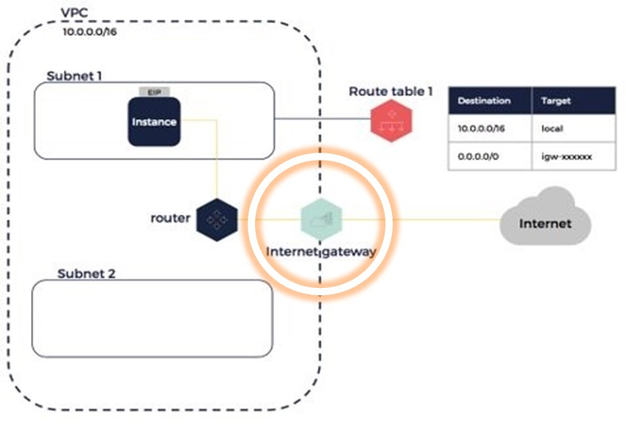
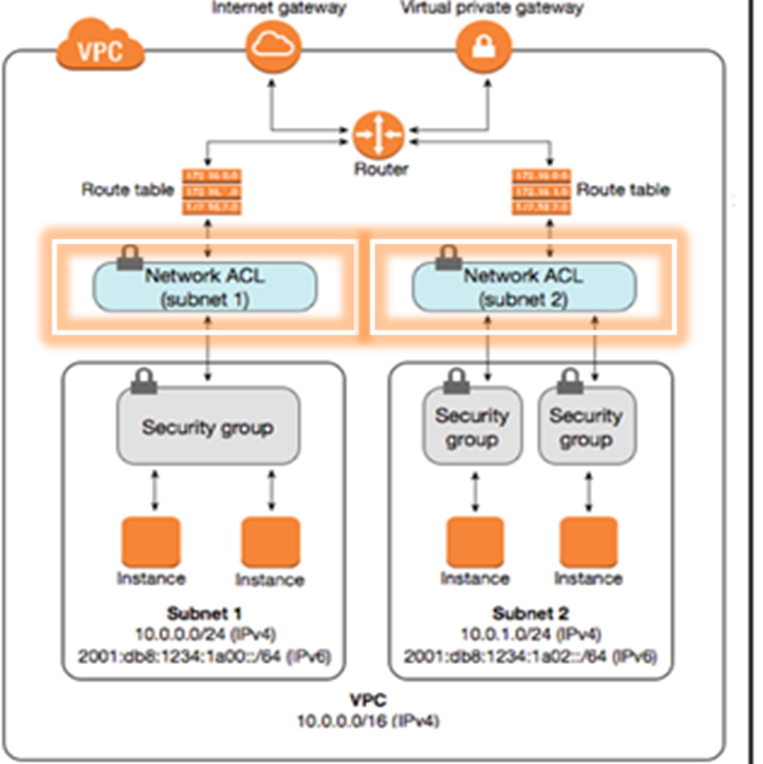

# Amazon Virtual Private Cloud (VPC)

**What is a VPC?**
- AWS isolated virtual network
- Allows control over virtual network environment
- Allows selection of your own IPs address range
- Can create multiple subnets within one VPC w specific network configuration
- Can use both IPv4 and IPv6 for most resources

## Internet Gateway

**What is an Internet Gateway?**
- Can transfer communications betweeen an enterprise network and the internet
- Allows internet access into VPC

## Subnets

**What is a Subnet?**
- A segmented piece of a largest network
- Its goal is to split large networks into groups of smaller, interconnected networks
    - Helps minimise traffic
    - Helps navigate traffic securely

## Route Tables

**What are Route Tables (RT)?**
- Contains a set of rules (routes)
- Determines direction of network traffic from subnet or gateway

## Network Access Control List (NACLs)

- These are stateless - we have to explicitly allow inbound and outbound rules
- They give an added layer of security at subnet level

## Security Groups

- Security on the subnet level
- Require SGs and NACLs both to allow more specificity on who can access certain instnaces within the the VPC

## Regions and Availability Zones

 

(There are 4.3 Billion IP addresses in the world)

**Todays Task:**

1. Create a VPC with IPV valid CIDR block
`10.101.0.0/16`
 - search VPC in AWS
 Single Public Subnet
 VPC name:
 Availabilty: eu-west-1a

2. Create internet gateway
    - Attach the IG to the VPC

3. Create route table
    - Edit route and insert your IG in `target`

4. Create public subnet
`10.101.1.0/24`
    - Associate public network with route table 

5. Create public NACLs
    - Set inbound and outbound rules for this

6. Create a Security Group for our app

## Creating a VPC

- In AWS, go to VPC directory
- Give sensible name
- IPv4 CIDR block: `10.101.0.0/16`

## Creating an Internet Gateway

- Create IG using directory on LHS
- Actions: Attatch to VPC

## Creating a Route Table

- Give name, select VPC, add tag
- Add route to IG

## Creating Public and Private Subnet

**PUBLIC**
- Choose VPC and name
- Availability Zone: `eu-west-1a`
- IPv4 CIDR Block: `10.101.1.0/24`

**PRIVATE**
Choose VPC and name
- Availability Zone: `eu-west-1a`
- IPv4 CIDR Block: `10.101.2.0/24`

- Go back to Route Table and add both
Subnet Associations

## Creating Public and Private NACLs

- public

| Rule | Source IP | Protocol | Port       | Allow/Deny |
|------|-----------|----------|------------|------------|
|  100 | 0.0.0.0/0 | TCP      | 80         | ALLOW      | 
|  110 | My IP     | TCP      | 22         | ALLOW      |
|  120 | 0.0.0.0/0 | TCP      | 1024-65535 | ALLOW      |
|   *  | 0.0.0.0/0 | all      | all        | DENY       |

OUTBOUND: 110 dest: PRIV SUBNET
- private

- umbrella
INBOUND: 100 HTTP 0.0.0.0/0
110 SSH My IP
120 TCP 1024-65535 0.0.0.0

OUTBOUND: 100 ALL
110 TCP 27017 PRIVATE SUBNET IPv4
120 TCP 1024-65535 0.0.0.0/0

## Creating Security Group for App

## Running Instance w AMIs

- launch amis
- enter app instance
- export DB_HOST (remember to change IP address)
- enter app folder
- node seeds/seed.js
- npm start
