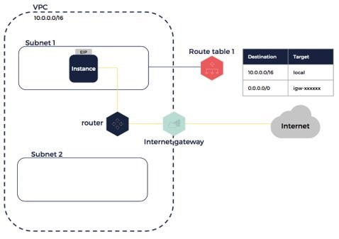
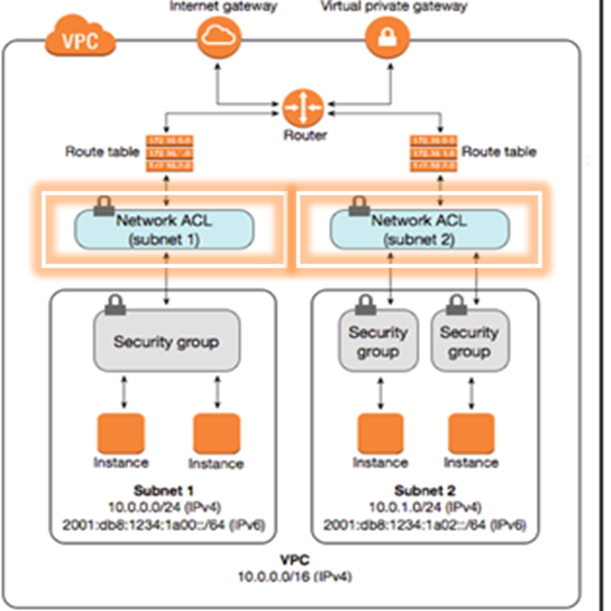

# Amazon Virtual Private Cloud (VPC)

**What is a VPC?**
- AWS isolated virtual network
- Allows control over virtual network environment
- Allows selection of your own IPs address range
- Can create multiple subnets within one VPC w specific network configuration
- Can use both IPv4 and IPv6 for most resources

## Internet Gateway

**What is an Internet Gateway?**
- Can transfer communications betweeen an enterprise network and the internet
- Allows internet access into VPC

## Subnets

**What is a Subnet?**
- A segmented piece of a largest network
- Its goal is to split large networks into groups of smaller, interconnected networks
    - Helps minimise traffic
    - Helps navigate traffic securely

## Route Tables

**What are Route Tables (RT)?**
- Contains a set of rules (routes)
- Determines direction of network traffic from subnet or gateway

## Network Access Control List (NACLs)

- These are stateless - we have to explicitly allow inbound and outbound rules
- They give an added layer of security at subnet level

## Security Groups

- Security on the subnet level
- Require SGs and NACLs both to allow more specificity on who can access certain instnaces within the the VPC

 

**Todays Task:**

(There are 4.3 Billion IP addresses in the world)

1. Create a VPC with IPV valid CIDR block
`10.0.0.0/16` 

2. Create internet gateway
    - Attach the IG to the VPC

3. Create route table
    - Edit route and insert you IG in `target`

4. Create public subnet
`10.0.1.0/24`
    - Associate public network with route table 

5. Create public NACLs
    - Set inbound and outbound rules for this

6. Create a Security Group for our app