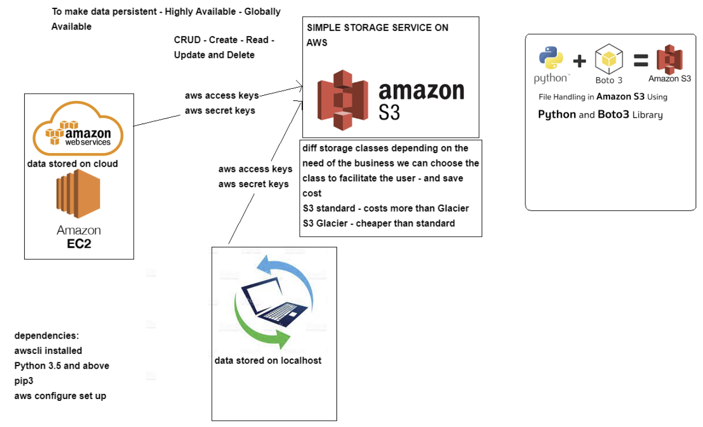

LINK TO ORIGINAL 
README


## CRUD - Create Read Update Delete
launch instance and install dependancies
```bash
sudo apt-get update -y
sudo apt-get upgrade -y
sudo apt-get install python
sudo apt-get install python3-pip
alias python=python3 (export to make it persistant)
python --version
python3 -m pip install awscli
```
## CREATE

configuration of AWS access keys
aws configure
 - key ID
 - secret key
 - default region name: eu-west-1
 - outout format: json
aws s3 ls

create a bucket (no underscore allowed in name)
```bash
aws s3 mb s3://sreakunma
sudo nano README.md
aws s3 cp README.md s3://sreakunma
rm -rf README.md
```

## READ

DOWNLOAD FROM S3

```bash
aws s3 cp s3://sreakunma/README.md ./
```

## UPDATE (SYNC)

in file directory:
```bash
aws s3 sync . s3://sreakunma/
```

## DELETE

```bash
aws s3 rb s3://sreakunma --force
```
## Python boto3

**TASKS:**
- Setting up awscli and python Env with required dependencies
- S3 authentication setup - with aws configure on EC2
- Create S3 bucket using python-boto3
- Upload data/file to S3 bucket using python-boto3
- Retrieve content/file from S3 using python-boto3
- Delete Content from S3 using python-boto3
- Delete the bucket using python-boto3.**
HINT: install and import boto3 - works with python3 and above


